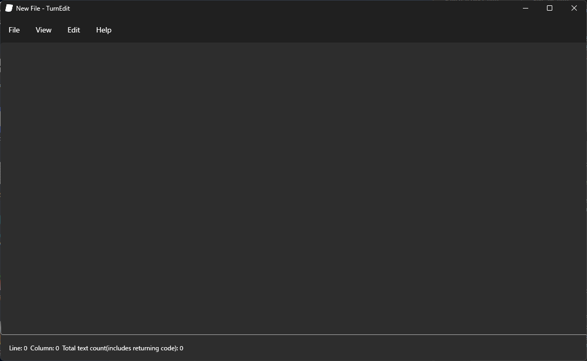

<h1 align="center">TurnEdit</h1>

TurnEdit is an simplified text editor written by C#.

  
Documents is here.  
日本語版は、こちらからご覧ください。  
## Features
- Search
- Replace
- Change font size

More feature is coming soon!
## How to install
1. Download turnedit-setup.exe.
2. Run turnedit-setup.exe as administrator.
<<<<<<< HEAD
## What's "Under construction" text?  
The "Under construction" text was developing feature, that feature may be not work.  
## Source code  
You can download source code in releases.  
if redistribute or change code, please add credit.  
[Please read README_SOURCE.md](src/README_SOURCE.md).  
===========  
## Contribute
[Click here to see how to contribute](https://github.com/suzuki3932/TurnEdit/blob/main/CONTRIBUTING.md).
## Others
This software is distribute to WinGet soon.
## License
TurnEdit is open-source.  
development by Bacon Hair(Self-proclaimed).  
Licensed by GNU general public license 3.0.  
[Click this](https://github.com/suzuki3932/TurnEdit?tab=GPL-3.0-1-ov-file) to see license text.  
&copy; 2025 youmu1948 All rights reserved.
